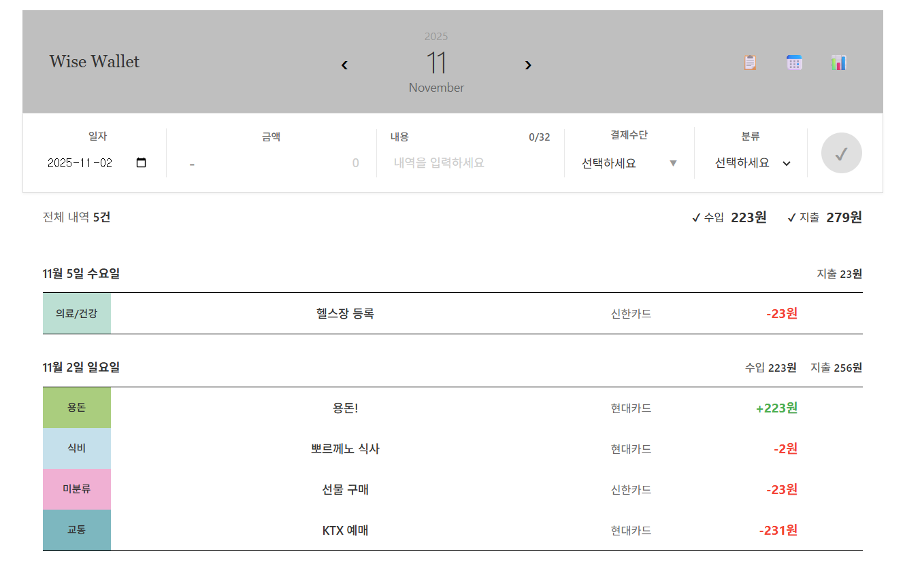
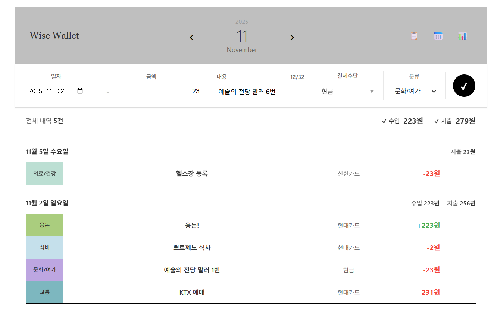
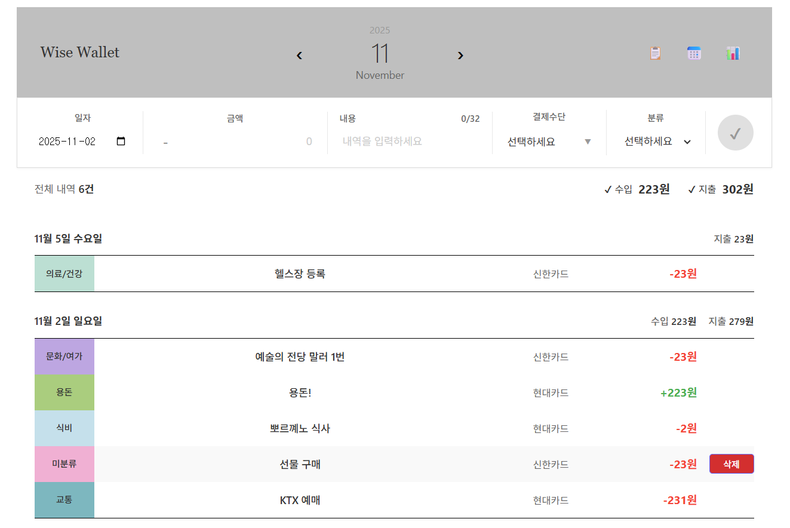

# bye2money
가계부 프로젝트

## Demo

### Main Screen


### Edit Transaction


### Delete Transaction


## How to run this project

### Vite Frontend

```bash
# move to the project directory
cd bye2money/vite-project

# install dependencies if needed
npm install

# run this project
npm run dev
```

This project will open at `http://localhost:5173`

### Express Backend

```bash
# move to the server directory
cd server

# install dependecies if needed
npm install

# run this project
npm run dev
```